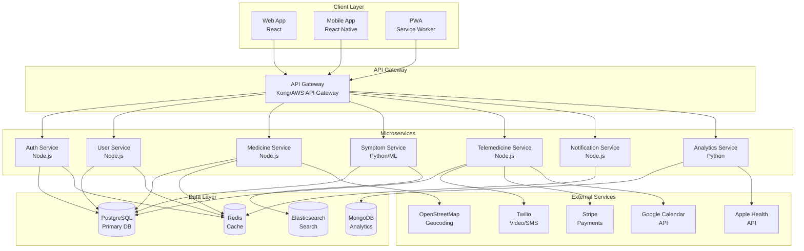
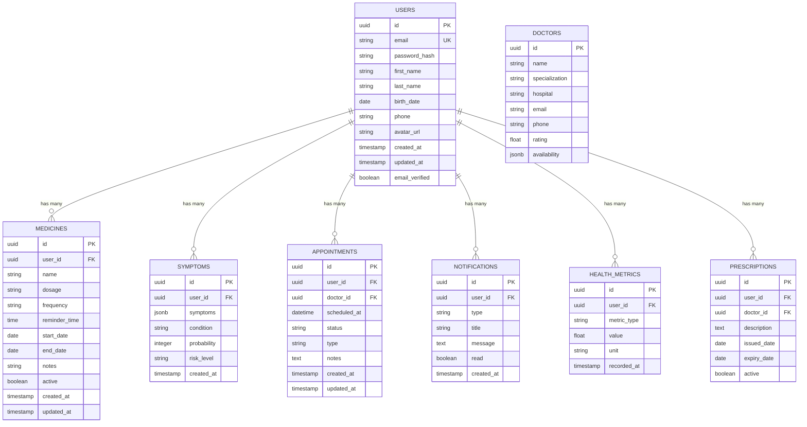
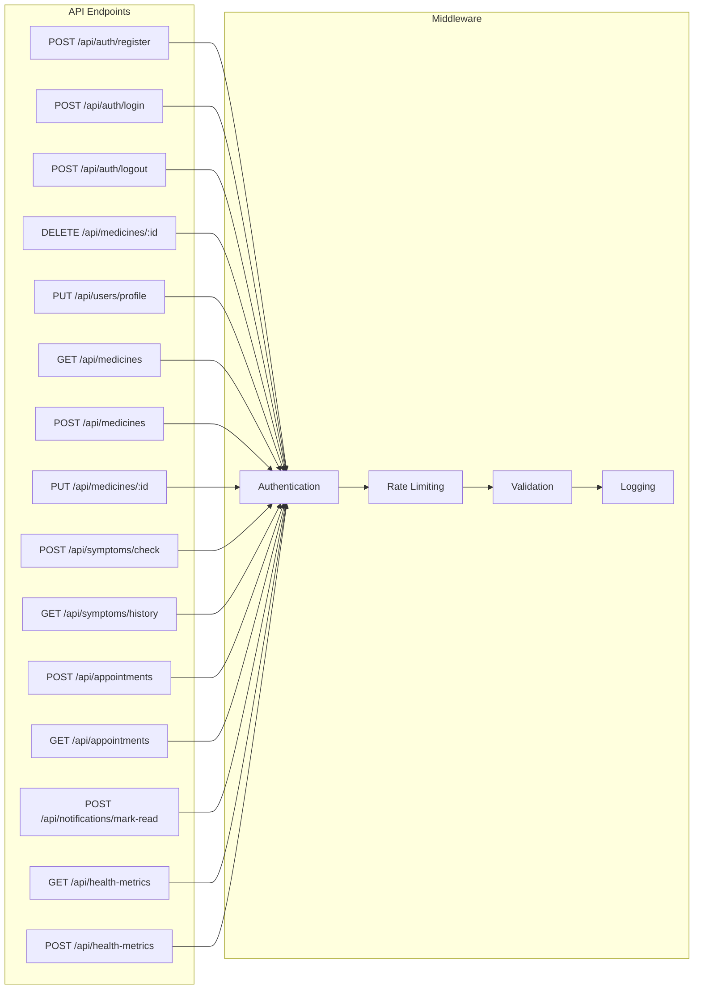
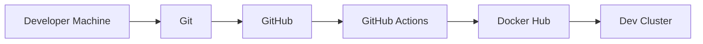
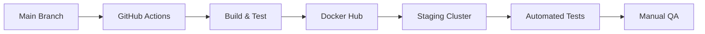

# CareSync: Future Roadmap & Technical Documentation

## Table of Contents
1. [Project Overview](#project-overview)
2. [Current Architecture](#current-architecture)
3. [Future Roadmap](#future-roadmap)
4. [Technical Architecture](#technical-architecture)
5. [Database Schema](#database-schema)
6. [API Design](#api-design)
7. [Implementation Phases](#implementation-phases)
8. [File Structure](#file-structure)
9. [Security Considerations](#security-considerations)
10. [Deployment Strategy](#deployment-strategy)
11. [Contributing Guidelines](#contributing-guidelines)

---

## Project Overview

**CareSync** is a comprehensive healthcare management platform designed to empower individuals to take control of their health management. The platform centralizes medicine reminders, symptom analysis, and local medical resource discovery into one cohesive application.

### Vision
To become the go-to platform for personal health management, providing accessible, intuitive, and secure healthcare tools for everyone.

### Mission
- Democratize access to healthcare information
- Provide tools for proactive health management
- Connect users with local healthcare resources
- Ensure privacy and security of health data

---

## Current Architecture

### Tech Stack (Current)
```
Frontend:
├── React 18.2.0
├── Material UI (MUI) 5.14.0
├── React Router DOM 6.20.1
├── TailwindCSS 3.4.1
└── Axios 1.6.0

Deployment:
└── Vercel

External APIs:
└── OpenStreetMap (Nominatim) - Geocoding
```

### Current Limitations
- No backend (data not persistent)
- No user authentication
- No real-time notifications
- No data synchronization across devices
- Limited symptom checker database
- No integration with healthcare providers
- No telemedicine capabilities

---

## Future Roadmap

### Phase 1: Foundation (Months 1-3)
**Goal**: Establish backend infrastructure and user authentication

#### Features
- [x] User Authentication (Login/Signup)
- [x] JWT-based authentication system
- [x] User profile management
- [x] Email verification
- [x] Password reset functionality
- [x] OAuth integration (Google, GitHub)
- [x] Backend API with Node.js/Express
- [x] PostgreSQL database setup
- [x] Data persistence for medicine tracker
- [x] Data persistence for symptom history

#### Technical Deliverables
- RESTful API with 15+ endpoints
- Database with 5+ core tables
- Authentication middleware
- Unit tests (80% coverage)
- API documentation (Swagger/OpenAPI)

---

### Phase 2: Enhanced Features (Months 4-6)
**Goal**: Add advanced features and improve user experience

#### Features
- [ ] Real-time push notifications for medicine reminders
- [ ] Integration with device calendars
- [ ] Advanced symptom checker with AI/ML
- [ ] Medicine interaction checker
- [ ] Dosage calculator
- [ ] Health metrics dashboard (weight, BP, etc.)
- [ ] Integration with wearable devices
- [ ] Multi-language support (i18n)
- [ ] Dark mode theme
- [ ] Offline mode support

#### Technical Deliverables
- WebSocket server for real-time updates
- Machine learning model for symptom analysis
- PWA capabilities
- 10+ language translations
- Service worker implementation

---

### Phase 3: Telemedicine Integration (Months 7-9)
**Goal**: Connect users with healthcare providers

#### Features
- [ ] Telemedicine appointment booking
- [ ] Video consultation integration
- [ ] Secure chat with healthcare providers
- [ ] Prescription management
- [ ] Lab results tracking
- [ ] Integration with EMR/EHR systems
- [ ] Insurance information management
- [ ] Payment gateway integration
- [ ] Doctor reviews and ratings
- [ ] Appointment reminders

#### Technical Deliverables
- Video conferencing API integration (Twilio/Agora)
- HIPAA-compliant data storage
- Payment processing (Stripe)
- Calendar integration (Google Calendar)
- Secure messaging system

---

### Phase 4: Advanced Analytics & AI (Months 10-12)
**Goal**: Leverage data for personalized health insights

#### Features
- [ ] AI-powered health predictions
- [ ] Personalized health recommendations
- [ ] Trend analysis for symptoms
- [ ] Medication adherence analytics
- [ ] Health risk assessment
- [ ] Integration with health APIs (Apple Health, Google Fit)
- [ ] Family health management
- [ ] Emergency contact management
- [ ] Medical document storage
- [ ] Export health reports (PDF)

#### Technical Deliverables
- Machine learning pipeline
- Data visualization dashboard
- Advanced analytics engine
- Report generation system
- Health API integrations

---

### Phase 5: Ecosystem Expansion (Months 13-18)
**Goal**: Build a comprehensive healthcare ecosystem

#### Features
- [ ] Pharmacy integration (order medicines)
- [ ] Lab test booking
- [ ] Ambulance booking
- [ ] Health insurance marketplace
- [ ] Community health forums
- [ ] Health challenges and gamification
- [ ] Integration with hospitals
- [ ] Corporate wellness programs
- [ ] Telehealth for remote areas
- [ ] Voice assistant integration

#### Technical Deliverables
- Microservices architecture
- Multi-tenant support
- Advanced caching layer (Redis)
- CDN integration
- Voice API integration
- Mobile apps (iOS/Android)

---

## Technical Architecture

### System Architecture Diagram



### Database Architecture



### API Architecture



---

## Database Schema

### Core Tables

#### users
```sql
CREATE TABLE users (
    id UUID PRIMARY KEY DEFAULT gen_random_uuid(),
    email VARCHAR(255) UNIQUE NOT NULL,
    password_hash VARCHAR(255) NOT NULL,
    first_name VARCHAR(100) NOT NULL,
    last_name VARCHAR(100) NOT NULL,
    birth_date DATE,
    phone VARCHAR(20),
    avatar_url TEXT,
    email_verified BOOLEAN DEFAULT FALSE,
    created_at TIMESTAMP DEFAULT CURRENT_TIMESTAMP,
    updated_at TIMESTAMP DEFAULT CURRENT_TIMESTAMP
);

CREATE INDEX idx_users_email ON users(email);
CREATE INDEX idx_users_created_at ON users(created_at);
```

#### medicines
```sql
CREATE TABLE medicines (
    id UUID PRIMARY KEY DEFAULT gen_random_uuid(),
    user_id UUID NOT NULL REFERENCES users(id) ON DELETE CASCADE,
    name VARCHAR(255) NOT NULL,
    dosage VARCHAR(100),
    frequency VARCHAR(50),
    reminder_time TIME,
    start_date DATE,
    end_date DATE,
    notes TEXT,
    active BOOLEAN DEFAULT TRUE,
    created_at TIMESTAMP DEFAULT CURRENT_TIMESTAMP,
    updated_at TIMESTAMP DEFAULT CURRENT_TIMESTAMP
);

CREATE INDEX idx_medicines_user_id ON medicines(user_id);
CREATE INDEX idx_medicines_active ON medicines(active);
CREATE INDEX idx_medicines_reminder_time ON medicines(reminder_time);
```

#### symptoms
```sql
CREATE TABLE symptoms (
    id UUID PRIMARY KEY DEFAULT gen_random_uuid(),
    user_id UUID NOT NULL REFERENCES users(id) ON DELETE CASCADE,
    symptoms JSONB NOT NULL,
    condition VARCHAR(255),
    probability INTEGER,
    risk_level VARCHAR(20),
    created_at TIMESTAMP DEFAULT CURRENT_TIMESTAMP
);

CREATE INDEX idx_symptoms_user_id ON symptoms(user_id);
CREATE INDEX idx_symptoms_created_at ON symptoms(created_at);
```

#### appointments
```sql
CREATE TABLE appointments (
    id UUID PRIMARY KEY DEFAULT gen_random_uuid(),
    user_id UUID NOT NULL REFERENCES users(id) ON DELETE CASCADE,
    doctor_id UUID REFERENCES doctors(id),
    scheduled_at TIMESTAMP NOT NULL,
    status VARCHAR(50) DEFAULT 'scheduled',
    type VARCHAR(50),
    notes TEXT,
    created_at TIMESTAMP DEFAULT CURRENT_TIMESTAMP,
    updated_at TIMESTAMP DEFAULT CURRENT_TIMESTAMP
);

CREATE INDEX idx_appointments_user_id ON appointments(user_id);
CREATE INDEX idx_appointments_scheduled_at ON appointments(scheduled_at);
CREATE INDEX idx_appointments_status ON appointments(status);
```

#### doctors
```sql
CREATE TABLE doctors (
    id UUID PRIMARY KEY DEFAULT gen_random_uuid(),
    name VARCHAR(255) NOT NULL,
    specialization VARCHAR(100),
    hospital VARCHAR(255),
    email VARCHAR(255),
    phone VARCHAR(20),
    rating DECIMAL(3,2),
    availability JSONB,
    created_at TIMESTAMP DEFAULT CURRENT_TIMESTAMP
);

CREATE INDEX idx_doctors_specialization ON doctors(specialization);
CREATE INDEX idx_doctors_rating ON doctors(rating);
```

#### notifications
```sql
CREATE TABLE notifications (
    id UUID PRIMARY KEY DEFAULT gen_random_uuid(),
    user_id UUID NOT NULL REFERENCES users(id) ON DELETE CASCADE,
    type VARCHAR(50) NOT NULL,
    title VARCHAR(255) NOT NULL,
    message TEXT NOT NULL,
    read BOOLEAN DEFAULT FALSE,
    created_at TIMESTAMP DEFAULT CURRENT_TIMESTAMP
);

CREATE INDEX idx_notifications_user_id ON notifications(user_id);
CREATE INDEX idx_notifications_read ON notifications(read);
```

#### health_metrics
```sql
CREATE TABLE health_metrics (
    id UUID PRIMARY KEY DEFAULT gen_random_uuid(),
    user_id UUID NOT NULL REFERENCES users(id) ON DELETE CASCADE,
    metric_type VARCHAR(50) NOT NULL,
    value DECIMAL(10,2) NOT NULL,
    unit VARCHAR(20),
    recorded_at TIMESTAMP NOT NULL,
    created_at TIMESTAMP DEFAULT CURRENT_TIMESTAMP
);

CREATE INDEX idx_health_metrics_user_id ON health_metrics(user_id);
CREATE INDEX idx_health_metrics_type ON health_metrics(metric_type);
CREATE INDEX idx_health_metrics_recorded_at ON health_metrics(recorded_at);
```

---

## API Design

### Authentication Endpoints

#### POST /api/auth/register
Register a new user account.

**Request Body:**
```json
{
  "email": "user@example.com",
  "password": "SecurePass123!",
  "first_name": "John",
  "last_name": "Doe",
  "phone": "+1234567890"
}
```

**Response (201):**
```json
{
  "success": true,
  "message": "Registration successful",
  "data": {
    "user": {
      "id": "uuid",
      "email": "user@example.com",
      "first_name": "John",
      "last_name": "Doe"
    },
    "token": "jwt_token_here"
  }
}
```

#### POST /api/auth/login
Authenticate user and return JWT token.

**Request Body:**
```json
{
  "email": "user@example.com",
  "password": "SecurePass123!"
}
```

**Response (200):**
```json
{
  "success": true,
  "data": {
    "token": "jwt_token_here",
    "user": {
      "id": "uuid",
      "email": "user@example.com",
      "first_name": "John",
      "last_name": "Doe"
    }
  }
}
```

### Medicine Endpoints

#### GET /api/medicines
Get all medicines for authenticated user.

**Headers:**
```
Authorization: Bearer <jwt_token>
```

**Response (200):**
```json
{
  "success": true,
  "data": [
    {
      "id": "uuid",
      "name": "Aspirin",
      "dosage": "100mg",
      "frequency": "daily",
      "reminder_time": "08:00",
      "start_date": "2024-01-01",
      "end_date": "2024-12-31",
      "active": true
    }
  ]
}
```

#### POST /api/medicines
Add a new medicine.

**Request Body:**
```json
{
  "name": "Aspirin",
  "dosage": "100mg",
  "frequency": "daily",
  "reminder_time": "08:00",
  "start_date": "2024-01-01",
  "end_date": "2024-12-31",
  "notes": "Take with food"
}
```

**Response (201):**
```json
{
  "success": true,
  "message": "Medicine added successfully",
  "data": {
    "id": "uuid",
    "name": "Aspirin",
    "dosage": "100mg",
    "frequency": "daily",
    "reminder_time": "08:00",
    "active": true
  }
}
```

### Symptom Checker Endpoints

#### POST /api/symptoms/check
Analyze symptoms and return possible conditions.

**Request Body:**
```json
{
  "symptoms": ["Fever", "Cough", "Headache"],
  "severity": "moderate",
  "duration": "3 days"
}
```

**Response (200):**
```json
{
  "success": true,
  "data": {
    "conditions": [
      {
        "name": "Viral Infection",
        "probability": 75,
        "risk_level": "medium",
        "causes": "Viral or bacterial infection",
        "solutions": [
          "Rest and drink fluids",
          "Consult a doctor if symptoms worsen"
        ]
      }
    ],
    "disclaimer": "This is not medical advice. Please consult a healthcare professional."
  }
}
```

### Appointment Endpoints

#### POST /api/appointments
Book a new appointment.

**Request Body:**
```json
{
  "doctor_id": "uuid",
  "scheduled_at": "2024-02-15T10:00:00Z",
  "type": "video_consultation",
  "notes": "Follow-up for fever"
}
```

**Response (201):**
```json
{
  "success": true,
  "message": "Appointment booked successfully",
  "data": {
    "id": "uuid",
    "doctor": {
      "name": "Dr. Smith",
      "specialization": "General Physician"
    },
    "scheduled_at": "2024-02-15T10:00:00Z",
    "status": "confirmed"
  }
}
```

### Health Metrics Endpoints

#### POST /api/health-metrics
Record a health metric.

**Request Body:**
```json
{
  "metric_type": "blood_pressure",
  "value": 120,
  "unit": "mmHg",
  "recorded_at": "2024-01-15T08:00:00Z"
}
```

**Response (201):**
```json
{
  "success": true,
  "message": "Health metric recorded",
  "data": {
    "id": "uuid",
    "metric_type": "blood_pressure",
    "value": 120,
    "unit": "mmHg",
    "recorded_at": "2024-01-15T08:00:00Z"
  }
}
```

---

## Implementation Phases

### Phase 1: Foundation (Months 1-3)

#### Week 1-2: Project Setup
- [ ] Initialize backend repository
- [ ] Set up Node.js/Express server
- [ ] Configure PostgreSQL database
- [ ] Set up development environment
- [ ] Configure ESLint, Prettier
- [ ] Set up CI/CD pipeline

#### Week 3-4: Authentication System
- [ ] Implement user registration
- [ ] Implement user login
- [ ] Add JWT authentication
- [ ] Add email verification
- [ ] Add password reset
- [ ] Write unit tests

#### Week 5-6: User Management
- [ ] Create user profile endpoints
- [ ] Implement profile update
- [ ] Add avatar upload
- [ ] Implement OAuth (Google, GitHub)
- [ ] Write integration tests

#### Week 7-8: Medicine Tracker Backend
- [ ] Create medicine CRUD endpoints
- [ ] Implement reminder logic
- [ ] Add medicine history
- [ ] Write API tests

#### Week 9-10: Symptom Checker Backend
- [ ] Create symptom check endpoint
- [ ] Implement symptom analysis logic
- [ ] Add symptom history
- [ ] Optimize algorithm
- [ ] Write tests

#### Week 11-12: Frontend Integration
- [ ] Connect frontend to backend
- [ ] Implement authentication flow
- [ ] Update medicine tracker with persistence
- [ ] Update symptom checker with persistence
- [ ] Add loading states
- [ ] Add error handling

### Phase 2: Enhanced Features (Months 4-6)

#### Month 4: Notifications
- [ ] Set up WebSocket server
- [ ] Implement push notifications
- [ ] Add notification preferences
- [ ] Integrate with device calendars
- [ ] Test notification delivery

#### Month 5: Advanced Features
- [ ] Implement medicine interaction checker
- [ ] Add dosage calculator
- [ ] Create health metrics dashboard
- [ ] Integrate with wearable devices
- [ ] Add data visualization

#### Month 6: Localization & PWA
- [ ] Implement i18n with react-i18next
- [ ] Add 10+ language translations
- [ ] Implement dark mode
- [ ] Add PWA capabilities
- [ ] Implement service worker
- [ ] Add offline support

### Phase 3: Telemedicine (Months 7-9)

#### Month 7: Video Integration
- [ ] Integrate Twilio/Agora for video
- [ ] Implement appointment booking
- [ ] Add calendar integration
- [ ] Create doctor profiles
- [ ] Implement scheduling system

#### Month 8: Secure Messaging
- [ ] Implement real-time chat
- [ ] Add end-to-end encryption
- [ ] Create message history
- [ ] Add file sharing
- [ ] Implement typing indicators

#### Month 9: Payments & Prescriptions
- [ ] Integrate Stripe for payments
- [ ] Implement prescription management
- [ ] Add lab results tracking
- [ ] Create invoice system
- [ ] Implement refund logic

### Phase 4: Analytics & AI (Months 10-12)

#### Month 10: ML Pipeline
- [ ] Set up ML infrastructure
- [ ] Train symptom prediction model
- [ ] Implement health risk assessment
- [ ] Create recommendation engine
- [ ] A/B test models

#### Month 11: Analytics Dashboard
- [ ] Create analytics dashboard
- [ ] Implement trend analysis
- [ ] Add medication adherence tracking
- [ ] Create health reports
- [ ] Implement export functionality

#### Month 12: Health API Integration
- [ ] Integrate Apple Health
- [ ] Integrate Google Fit
- [ ] Add family health management
- [ ] Implement emergency contacts
- [ ] Add medical document storage

### Phase 5: Ecosystem (Months 13-18)

#### Month 13-14: Microservices
- [ ] Split monolith to microservices
- [ ] Implement API Gateway
- [ ] Add service discovery
- [ ] Implement distributed tracing
- [ ] Add circuit breakers

#### Month 15-16: Additional Services
- [ ] Pharmacy integration
- [ ] Lab test booking
- [ ] Ambulance booking
- [ ] Insurance marketplace
- [ ] Community forums

#### Month 17-18: Mobile & Voice
- [ ] Build iOS app
- [ ] Build Android app
- [ ] Implement voice assistant
- [ ] Add corporate wellness
- [ ] Launch telehealth for remote areas

---

## File Structure

### Future Project Structure

```
caresync/
├── backend/
│   ├── src/
│   │   ├── config/
│   │   │   ├── database.js
│   │   │   ├── redis.js
│   │   │   ├── jwt.js
│   │   │   └── aws.js
│   │   ├── controllers/
│   │   │   ├── auth.controller.js
│   │   │   ├── user.controller.js
│   │   │   ├── medicine.controller.js
│   │   │   ├── symptom.controller.js
│   │   │   ├── appointment.controller.js
│   │   │   ├── notification.controller.js
│   │   │   └── health.controller.js
│   │   ├── middleware/
│   │   │   ├── auth.middleware.js
│   │   │   ├── validation.middleware.js
│   │   │   ├── rateLimit.middleware.js
│   │   │   ├── error.middleware.js
│   │   │   └── upload.middleware.js
│   │   ├── models/
│   │   │   ├── User.js
│   │   │   ├── Medicine.js
│   │   │   ├── Symptom.js
│   │   │   ├── Appointment.js
│   │   │   ├── Doctor.js
│   │   │   ├── Notification.js
│   │   │   └── HealthMetric.js
│   │   ├── routes/
│   │   │   ├── auth.routes.js
│   │   │   ├── user.routes.js
│   │   │   ├── medicine.routes.js
│   │   │   ├── symptom.routes.js
│   │   │   ├── appointment.routes.js
│   │   │   ├── notification.routes.js
│   │   │   └── health.routes.js
│   │   ├── services/
│   │   │   ├── auth.service.js
│   │   │   ├── email.service.js
│   │   │   ├── notification.service.js
│   │   │   ├── payment.service.js
│   │   │   ├── video.service.js
│   │   │   └── ml.service.js
│   │   ├── utils/
│   │   │   ├── logger.js
│   │   │   ├── validators.js
│   │   │   ├── helpers.js
│   │   │   └── constants.js
│   │   ├── workers/
│   │   │   ├── notification.worker.js
│   │   │   ├── email.worker.js
│   │   │   └── analytics.worker.js
│   │   ├── tests/
│   │   │   ├── unit/
│   │   │   ├── integration/
│   │   │   └── e2e/
│   │   ├── app.js
│   │   └── server.js
│   ├── migrations/
│   ├── seeds/
│   ├── .env.example
│   ├── package.json
│   └── README.md
├── frontend/
│   ├── public/
│   ├── src/
│   │   ├── assets/
│   │   ├── components/
│   │   │   ├── common/
│   │   │   ├── layout/
│   │   │   ├── medicine/
│   │   │   ├── symptom/
│   │   │   ├── appointment/
│   │   │   └── health/
│   │   ├── pages/
│   │   ├── hooks/
│   │   ├── context/
│   │   ├── services/
│   │   ├── utils/
│   │   ├── i18n/
│   │   ├── theme/
│   │   ├── App.jsx
│   │   └── index.js
│   ├── .env.example
│   ├── package.json
│   └── README.md
├── mobile/
│   ├── ios/
│   ├── android/
│   ├── src/
│   └── package.json
├── ml-service/
│   ├── src/
│   │   ├── models/
│   │   ├── training/
│   │   ├── inference/
│   │   └── api/
│   ├── data/
│   ├── notebooks/
│   └── requirements.txt
├── docs/
│   ├── api/
│   ├── architecture/
│   ├── deployment/
│   └── contributing/
├── scripts/
│   ├── deploy.sh
│   ├── backup.sh
│   └── migrate.sh
├── docker/
│   ├── Dockerfile.backend
│   ├── Dockerfile.frontend
│   ├── docker-compose.yml
│   └── nginx.conf
├── kubernetes/
│   ├── deployments/
│   ├── services/
│   ├── ingress/
│   └── configmaps/
├── .github/
│   ├── workflows/
│   ├── ISSUE_TEMPLATE/
│   └── PULL_REQUEST_TEMPLATE.md
├── .gitignore
├── LICENSE
├── README.md
└── FUTURE_ROADMAP.md
```

---

## Security Considerations

### Data Security
- **Encryption at Rest**: All sensitive data encrypted using AES-256
- **Encryption in Transit**: TLS 1.3 for all API communications
- **Password Hashing**: bcrypt with salt rounds >= 12
- **PII Protection**: Compliance with GDPR, HIPAA
- **Data Minimization**: Collect only necessary data

### Authentication & Authorization
- **JWT Tokens**: Short-lived access tokens (15 min) + refresh tokens (7 days)
- **Multi-Factor Authentication**: Optional 2FA via SMS/Email
- **OAuth 2.0**: Integration with Google, GitHub
- **Role-Based Access Control**: Admin, Doctor, Patient roles
- **Session Management**: Secure cookie handling

### API Security
- **Rate Limiting**: 100 requests/minute per user
- **Input Validation**: Strict validation on all inputs
- **SQL Injection Prevention**: Parameterized queries
- **XSS Protection**: Content Security Policy headers
- **CSRF Protection**: Token-based CSRF protection

### Infrastructure Security
- **Vulnerability Scanning**: Regular dependency audits
- **Secrets Management**: AWS Secrets Manager / HashiCorp Vault
- **Network Security**: VPC with private subnets
- **DDoS Protection**: Cloudflare / AWS Shield
- **Monitoring**: Security event logging and alerting

### Compliance
- **HIPAA**: Healthcare data protection
- **GDPR**: EU data protection regulations
- **SOC 2**: Security controls certification
- **PCI DSS**: Payment card security (if applicable)

---

## Deployment Strategy

### Development Environment


### Staging Environment


### Production Environment


### Infrastructure

#### Cloud Provider: AWS
- **Compute**: EC2 / EKS (Kubernetes)
- **Database**: RDS PostgreSQL
- **Cache**: ElastiCache Redis
- **Storage**: S3 (for files, backups)
- **CDN**: CloudFront
- **Load Balancer**: ALB / NLB
- **Monitoring**: CloudWatch, X-Ray
- **Logging**: CloudWatch Logs, ELK Stack

#### Alternative: Google Cloud Platform
- **Compute**: GKE (Kubernetes)
- **Database**: Cloud SQL PostgreSQL
- **Cache**: Memorystore
- **Storage**: Cloud Storage
- **CDN**: Cloud CDN
- **Load Balancer**: Cloud Load Balancing
- **Monitoring**: Cloud Monitoring, Cloud Trace

#### Alternative: Azure
- **Compute**: AKS (Kubernetes)
- **Database**: Azure Database for PostgreSQL
- **Cache**: Azure Cache for Redis
- **Storage**: Azure Blob Storage
- **CDN**: Azure CDN
- **Load Balancer**: Azure Load Balancer
- **Monitoring**: Azure Monitor, Application Insights

### CI/CD Pipeline

#### GitHub Actions Workflow
```yaml
name: CI/CD Pipeline

on:
  push:
    branches: [main, develop]
  pull_request:
    branches: [main]

jobs:
  test:
    runs-on: ubuntu-latest
    steps:
      - uses: actions/checkout@v3
      - name: Setup Node.js
        uses: actions/setup-node@v3
        with:
          node-version: '18'
      - name: Install dependencies
        run: npm ci
      - name: Run linter
        run: npm run lint
      - name: Run tests
        run: npm run test
      - name: Build
        run: npm run build

  deploy:
    needs: test
    runs-on: ubuntu-latest
    if: github.ref == 'refs/heads/main'
    steps:
      - uses: actions/checkout@v3
      - name: Build Docker image
        run: docker build -t caresync:${{ github.sha }} .
      - name: Push to Docker Hub
        run: docker push caresync:${{ github.sha }}
      - name: Deploy to Kubernetes
        run: kubectl set image deployment/caresync caresync=caresync:${{ github.sha }}
```

### Monitoring & Observability

#### Metrics to Track
- **Application Metrics**: Response time, error rate, throughput
- **Business Metrics**: Active users, appointments booked, medicines tracked
- **Infrastructure Metrics**: CPU, memory, disk usage, network I/O
- **Custom Metrics**: Notification delivery rate, API usage per endpoint

#### Logging Strategy
- **Structured Logging**: JSON format with consistent fields
- **Log Levels**: DEBUG, INFO, WARN, ERROR, FATAL
- **Centralized Logging**: ELK Stack or CloudWatch Logs
- **Log Retention**: 90 days for production, 30 days for staging

#### Alerting
- **Critical Alerts**: Service down, database connection failed, security breach
- **Warning Alerts**: High error rate, slow response time, high memory usage
- **Info Alerts**: Deployments, configuration changes
- **Notification Channels**: Slack, PagerDuty, Email

---

## Contributing Guidelines

### For Contributors

#### Getting Started
1. Fork the repository
2. Create a feature branch: `git checkout -b feature/amazing-feature`
3. Make your changes
4. Write tests for your changes
5. Ensure all tests pass: `npm test`
6. Commit your changes: `git commit -m 'Add amazing feature'`
7. Push to branch: `git push origin feature/amazing-feature`
8. Open a Pull Request

#### Code Style
- Follow ESLint configuration
- Use Prettier for formatting
- Write meaningful commit messages
- Add comments for complex logic
- Keep functions small and focused

#### Testing
- Unit tests for all new functions
- Integration tests for API endpoints
- E2E tests for critical user flows
- Aim for 80%+ code coverage

#### Documentation
- Update README if needed
- Add JSDoc comments to functions
- Document API endpoints
- Update CHANGELOG.md

### For Maintainers

#### Release Process
1. Update version in package.json
2. Update CHANGELOG.md
3. Create git tag: `git tag v1.0.0`
4. Push tag: `git push origin v1.0.0`
5. Create GitHub Release
6. Deploy to production

#### Issue Triage
- Label new issues within 24 hours
- Respond to questions within 48 hours
- Prioritize bugs over features
- Assign issues to contributors

#### Code Review
- Review PRs within 3 days
- Provide constructive feedback
- Ensure tests pass
- Verify documentation is updated
- Approve only when ready to merge

---

## Success Metrics

### User Engagement
- **Monthly Active Users (MAU)**: Target 10,000 by end of Year 1
- **User Retention**: 40% retention after 30 days
- **Session Duration**: Average 5+ minutes per session
- **Feature Adoption**: 60% of users use medicine tracker

### Business Metrics
- **Appointment Bookings**: 1,000+ appointments per month
- **Medicine Reminders**: 50,000+ reminders sent per month
- **Symptom Checks**: 5,000+ checks per month
- **Premium Subscriptions**: 5% conversion rate

### Technical Metrics
- **API Response Time**: < 200ms (p95)
- **Uptime**: 99.9% availability
- **Error Rate**: < 0.1%
- **Test Coverage**: > 80%

---

## Budget Estimation

### Development Costs (Year 1)
- **Development Team**: $200,000 (2-3 developers)
- **Design**: $30,000
- **Testing/QA**: $40,000
- **Project Management**: $50,000
- **Total**: $320,000

### Infrastructure Costs (Year 1)
- **AWS/GCP**: $5,000/month
- **Third-party APIs**: $1,000/month
- **CDN**: $500/month
- **Monitoring**: $200/month
- **Total**: $8,200/month ($98,400/year)

### Marketing Costs (Year 1)
- **Digital Marketing**: $50,000
- **Content Marketing**: $20,000
- **PR**: $30,000
- **Total**: $100,000

### Total Year 1 Budget: $518,400

---

## Risk Assessment

### Technical Risks
| Risk | Probability | Impact | Mitigation |
|------|-------------|--------|------------|
| Database failure | Low | High | Multi-region replication, automated backups |
| API rate limits | Medium | Medium | Implement caching, rate limiting |
| Security breach | Low | Critical | Regular audits, penetration testing |
| Third-party API downtime | Medium | Medium | Fallback mechanisms, multiple providers |

### Business Risks
| Risk | Probability | Impact | Mitigation |
|------|-------------|--------|------------|
| Low user adoption | Medium | High | User research, iterative improvements |
| Competition | High | Medium | Focus on unique features, user experience |
| Regulatory changes | Medium | High | Legal consultation, compliance monitoring |
| Funding shortage | Medium | Critical | Diverse funding sources, lean operations |

---

## Conclusion

This roadmap provides a comprehensive vision for CareSync's evolution from a simple web application to a full-featured healthcare ecosystem. The phased approach ensures manageable development cycles while delivering value to users at each stage.

**Key Success Factors:**
1. **User-Centric Design**: Always prioritize user needs and feedback
2. **Security First**: Ensure healthcare data is protected at all costs
3. **Scalable Architecture**: Build for growth from day one
4. **Continuous Improvement**: Iterate based on metrics and feedback
5. **Community Engagement**: Foster a strong open-source community

**Next Steps:**
1. Review and approve this roadmap
2. Secure funding for Phase 1
3. Assemble development team
4. Begin Phase 1 implementation
5. Establish regular review cycles

---

*Last Updated: January 2026*
*Version: 1.0*
*Maintained by: CareSync Team*
